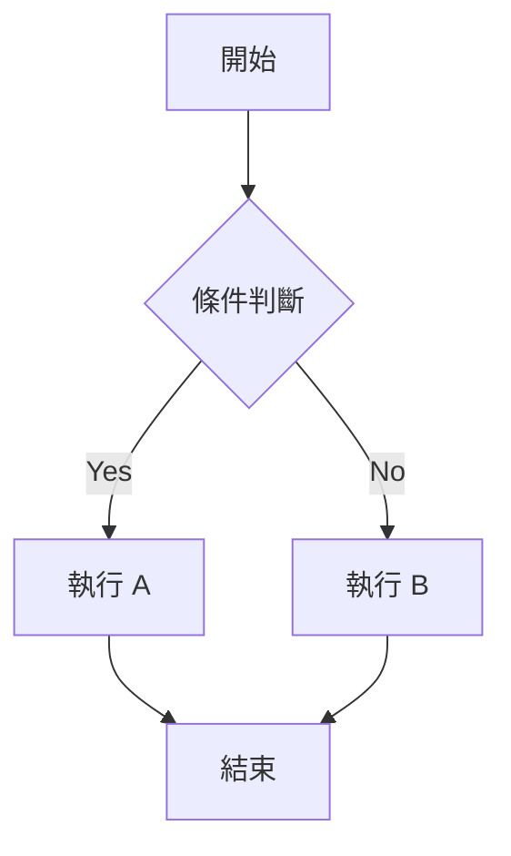
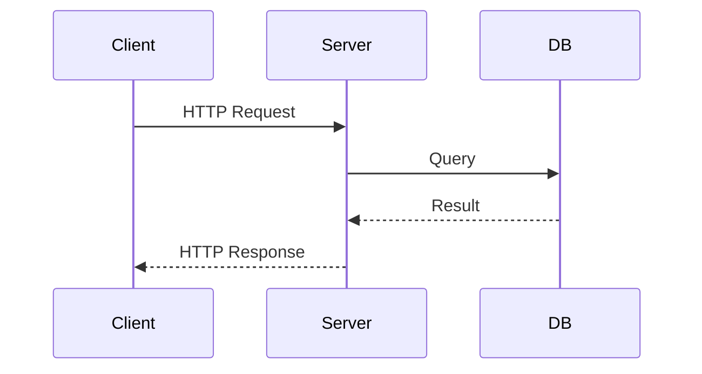

# H1 標題

## H2 標題

### H3 標題

#### H4 標題

##### H5 標題

###### H6 標題

---

## 段落與行內樣式

這是一段普通文字。Markdown 的核心精神就是**讓你專注在內容**，而不是排版。

你可以用 **粗體**、*斜體*、~~刪除線~~、`inline code`，也可以混搭 **_粗斜體_**。

> 這是 blockquote。適合拿來放引言或重點提示。
>
> 可以多行。

---

## 列表

### 無序列表

- 第一項
- 第二項
  - 巢狀項目 A
  - 巢狀項目 B
- 第三項

### 有序列表

1. 先做這個
2. 再做那個
3. 最後收尾

### 任務列表

- [x] 已完成
- [ ] 待處理
- [ ] 還沒開始

---

## 連結與圖片

[Google](https://www.google.com)


---

## 表格

| 方法 | 時間複雜度 | 空間複雜度 | 穩定 |
|------|-----------|-----------|------|
| Bubble Sort | $O(n^2)$ | O(1) | Yes |
| Quick Sort | O(n log n) | O(log n) | No |
| Merge Sort | O(n log n) | O(n) | Yes |

---

## 程式碼（Prism.js 語法高亮）

### Go

```go
func twoSum(nums []int, target int) []int {
    seen := make(map[int]int) // 用 map 記錄看過的數
    for i, n := range nums {
        if j, ok := seen[target-n]; ok {
            return []int{j, i} // 找到配對，直接回傳
        }
        seen[n] = i
    }
    return nil
}
```

### TypeScript

```typescript
function twoSum(nums: number[], target: number): number[] {
  const seen = new Map<number, number>(); // 用 Map 記錄看過的數
  for (let i = 0; i < nums.length; i++) {
    const complement = target - nums[i];
    if (seen.has(complement)) {
      return [seen.get(complement)!, i]; // 找到配對
    }
    seen.set(nums[i], i);
  }
  return [];
}
```

---

## Emoji

:+1: `:+1:` :heart: `:heart:` :rocket: `:rocket:`

---

## KaTeX 數學公式

行內公式：$E = mc^2$

區塊公式：

$$
\sum_{i=1}^{n} i = \frac{n(n+1)}{2}
$$

$$
f(x) = \int_{-\infty}^{\infty} \hat{f}(\xi) \, e^{2\pi i \xi x} \, d\xi
$$

---

## Mermaid 圖表





---

## Clipboard.js

> 啟用後，所有 code block 會自動出現複製按鈕。上方的程式碼區塊都可以測試。

---

## 總結

| 功能 | 套件 | 狀態 |
|------|------|------|
| Markdown → HTML | marked | ✅ 已啟用 |
| 語法高亮 | prismjs | ✅ 已啟用 |
| Emoji | emoji-toolkit | ✅ 已啟用 |
| 數學公式 | katex | ✅ 已啟用 |
| 圖表 | mermaid | ✅ 已啟用 |
| 複製程式碼 | clipboard | ✅ 已啟用 |
